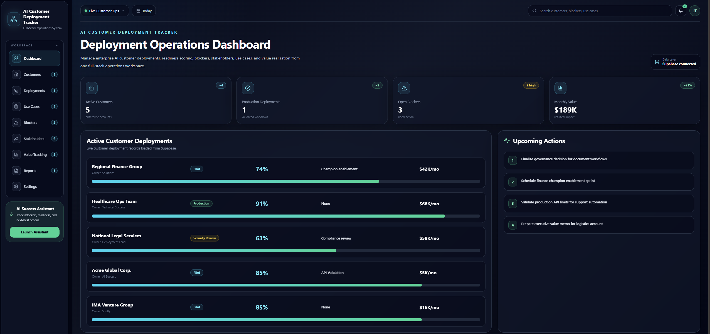
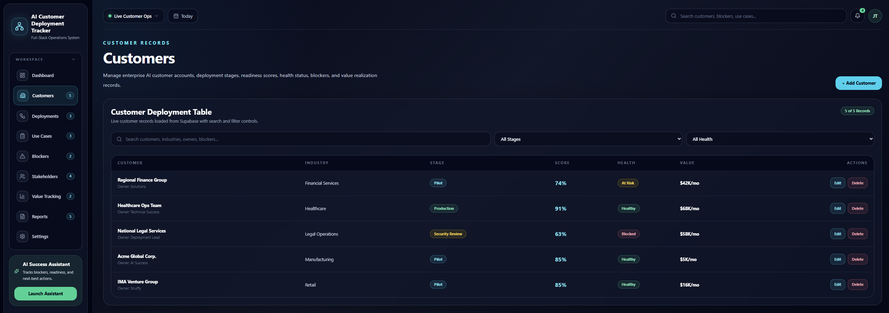
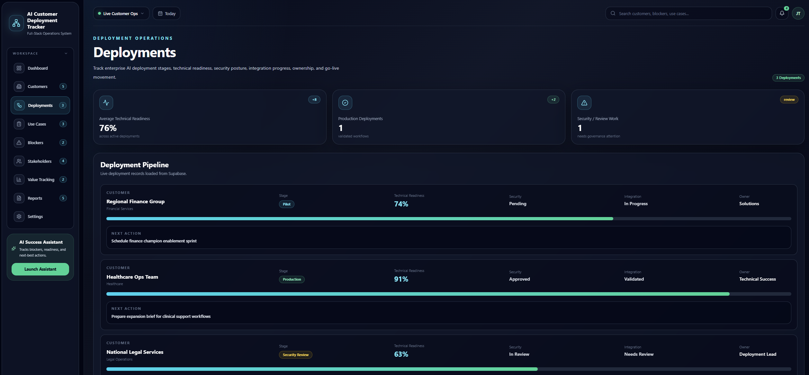
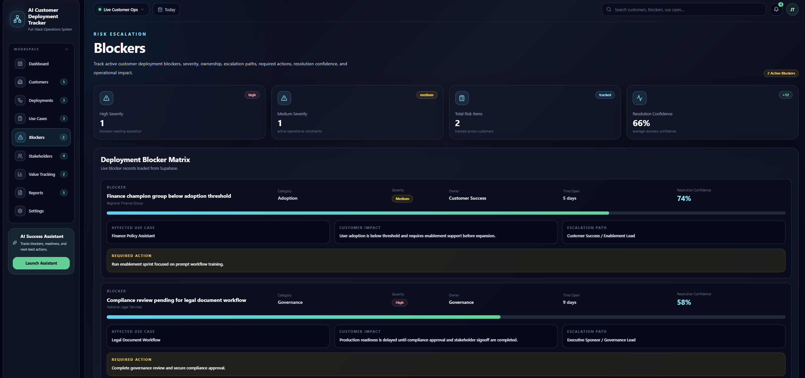
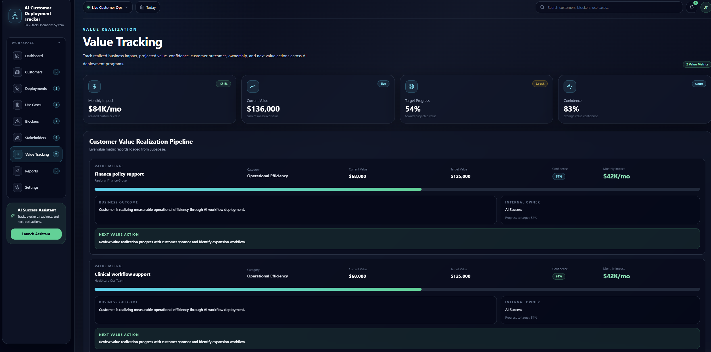
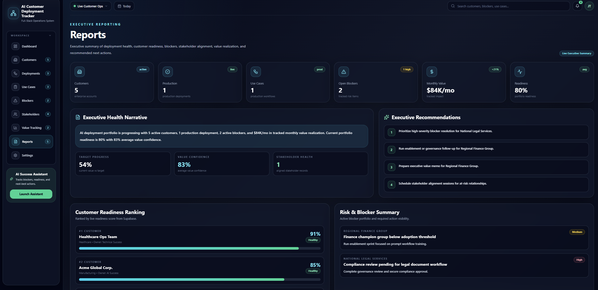

# AI Customer Deployment Tracker

Live Demo: https://ai-customer-deployment-tracker.vercel.app  
GitHub: https://github.com/jtorres507-rgb/ai-customer-deployment-tracker

---

## Overview

AI Customer Deployment Tracker is a full-stack enterprise AI Success operations platform built to manage customer deployments, AI use case activation, blockers, stakeholder alignment, and measurable value realization.

The application was designed to simulate how an AI Success Engineer, Solutions Engineer, or Technical Customer Success team could operationalize enterprise AI adoption across multiple customer accounts.

This project connects technical deployment readiness, customer health, workflow adoption, stakeholder engagement, and business value into one executive-ready SaaS workspace.

---

## Why I Built This

Enterprise AI adoption requires more than launching a model or shipping a feature.

Successful AI deployment depends on:

- Customer readiness
- Security and integration review
- Use case activation
- Stakeholder alignment
- Blocker escalation
- Business value measurement
- Executive communication

I built this project to demonstrate how those workflows can be translated into a full-stack operational system.

## Screenshots

### Dashboard



### Customers



### Deployments



### Blockers



### Value Tracking



### Reports




---

## Core Features

### Executive Dashboard

The dashboard provides a live overview of the AI customer deployment portfolio.

It includes:

- Active customers
- Production deployments
- Open blockers
- Monthly value
- Upcoming actions
- Supabase connection status

---

### Customer Management

The Customers page provides live customer account management.

Features include:

- Customer records loaded from Supabase
- Customer readiness scoring
- Health status tracking
- Deployment stage tracking
- Monthly value tracking
- Primary blocker tracking
- Next action tracking
- Search and filtering
- Add, edit, and delete customer records

---

### Deployment Tracking

The Deployments page tracks technical implementation progress across customer accounts.

It includes:

- Deployment stage
- Technical readiness
- Security status
- Integration status
- Deployment owner
- Next action
- Customer relationship joins from Supabase

---

### Use Case Activation

The Use Cases page tracks AI workflow maturity and business adoption.

It includes:

- Use case name
- Customer relationship
- Stage
- Monthly value
- Confidence score
- Risk level
- Workflow detail
- Next milestone
- Technical owner

---

### Blocker Management

The Blockers page tracks deployment risks and escalation items.

It includes:

- Blocker title
- Category
- Severity
- Owner
- Time open
- Resolution confidence
- Affected use case
- Customer impact
- Escalation path
- Required action

---

### Stakeholder Alignment

The Stakeholders page tracks customer relationship health and adoption alignment.

It includes:

- Executive sponsors
- Business owners
- Technical champions
- Department
- Function area
- Influence level
- Sentiment
- Engagement status
- Last touchpoint
- Internal owner
- Next stakeholder action

---

### Value Tracking

The Value Tracking page connects AI deployment activity to measurable business impact.

It includes:

- Monthly impact
- Current value
- Target value
- Target progress
- Confidence score
- Business outcome
- Internal owner
- Next value action

---

### Executive Reports

The Reports page provides an executive-ready portfolio summary.

It includes:

- Executive health narrative
- Customer readiness ranking
- Risk and blocker summary
- Stakeholder alignment summary
- Value realization summary
- Executive recommendations

This page is designed for portfolio screenshots, LinkedIn, and interview demos.

---

## Tech Stack

- React
- TypeScript
- Vite
- Tailwind CSS
- Supabase
- PostgreSQL
- Lucide React Icons
- GitHub
- Vercel

---

## Architecture

The frontend is built with React, TypeScript, Vite, and Tailwind CSS.

Supabase is used as the backend data layer with PostgreSQL tables for customer success operations data.

The application uses relational joins to connect customer records to deployments, use cases, blockers, stakeholders, and value metrics.

Example Supabase relationship query:

```ts
const { data, error } = await supabase
  .from("deployments")
  .select(`
    *,
    customers (
      company_name,
      industry
    )
  `);
